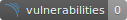

[](https://www.codefactor.io/repository/github/sailsforce/togo-read-micro)   [](https://results.pre-commit.ci/latest/github/sailsforce/togo-read-micro/main) [](https://codecov.io/gh/sailsforce/inv-read-micro)

# togo-read-micro
Togo read micro-service

## Install pre-commit
```
brew install pre-commit
```

## Run Application Using Doppler
```
go build -o bin/togo-read -v .
doppler run --command="./bin/togo-read"
```

## Run Tests Using Doppler
```
doppler run --command="go test -v ./tests -coverprofile=./coverage.out -coverpkg ./..."
```

## Upload to Codecov
``` 
./codecov -t ${CODECOV_TOKEN}
``` 

## Run SonarQube
```
sonar-scanner \
  -Dsonar.projectKey=togo-read-micro \
  -Dsonar.sources=. \
  -Dsonar.host.url=${SONAR_HOST_URL} \
  -Dsonar.login=${SONAR_LOGIN}
```

## Update SonarQube badges
```
curl ${badge_url} > ./badges/securityRating.svg
curl ${badge_url} > ./badges/vulnerabilities.svg
```